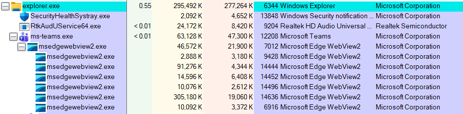

# Project 01-Windows Process Investigation Using Process Explorer 
## Objective 
The objective of this project was to investigate running Windows processes using Microsoft Process Explorer. The investigation focused on understanding parent-child process relationships, identifying normal Windows behaviour, and documenting observations as part of a SOC analyst investigation.
---
##   Tools Used 
- Microsoft Process Explorer
- Windows 11
---
## Investigations Steps
1. Installed Microsoft Process Explorer.
2. Launched Process Explorer as Adminstrator.
3. Investigated the Windows process tree.
4. Examined parent-child relationships.
5. Investigated Windows Explorer, Microsoft Teams, and Microsoft Edge processes.
6. Identified normal Windows process behaviour.
---
## Evidence Collected 
### Process Tree
### Figure 1- Process Explorer Process Tree
Figure 1 shows the Process Explorer process tree collected during the Windows endpoint investigation. The evidence was reviewed to identify normal and abnormal parent-child process relationships.

The investigation identified the following normal parent-child process relationships:
- winlogon.exe -> explorer.exe
- explorer.exe -> SecurityHealthSystray.exe
- explorer.exe -> ms-teams.exe
- explorer.exe -> msedge.exe
- ms-teams.exe -> msedgewebview2.exe
- msedge.exe -> Multiple msedge.exe processes

The observed process hierachy was consistent with normal Windows 11 system behaviour. No indicators of malicious process execution were indentified during this investigation.

---
## Findings
- explorer.exe launched expected desktop applications.
- Microsoft Teams created multiple msedgewebview2.exe child processes.
- Microsoft Edge created multiple browser processes, consistent with Chromium architecture.
- No suspicious parent-child relationships were indentified.
---
## Conclusion 
The Windows process hierarchy appeared consistent with normal Windows behaviour. No evidence of suspicious or malicious process execution was identified during this investigation.

---
## Skills Demonstrated 
- Windows Process Investigation
- Process Tree Analysis
- Parent-Child processs Analysis
- Endpoint Investigation
- Basic DFIR
