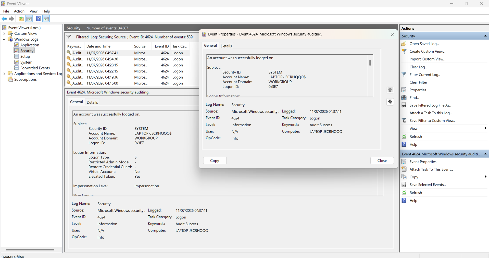

# Project 02 - Windows Event Viewer Security Log Investigation

## Objective

The objective of this project was to investigate Windows Security logs using Event Viewer. The investigation focused on identifying successful logon events, understanding Windows authentication logs, and documenting findings from a SOC analyst perspective.

---

## Tools Used

- Windows Event Viewer
- Windows 11
- Windows Security Logs

---

## Investigation Steps

1. Opened Windows Event Viewer.
2. Navigated to **Windows Logs → Security**.
3. Applied a filter for **Event ID 4624**.
4. Reviewed successful logon events.
5. Opened Event Properties to examine authentication details.
6. Documented observations and findings.

---

## Evidence Collected

### Figure 1 – Successful Logon Event (Event ID 4624)

The screenshot below shows Windows Event Viewer displaying Security Event ID 4624 after filtering the Security log for successful authentication events.

The investigation identified the following observations:

- Event ID **4624** represents a successful user logon.
- The event was recorded in the Windows Security log.
- Authentication completed successfully.
- Logon Type **5** was observed.
- Audit Success confirmed the authentication event.
- No failed authentication attempts were identified during this investigation.

---

## Findings

- Successfully filtered Windows Security logs using Event Viewer.
- Verified that Event ID 4624 records successful authentication activity.
- Reviewed authentication details including:
- Security ID
- Account Name
- Account Domain
- Logon ID
- Computer Name
- Logon Type
- No indicators of suspicious authentication behaviour were identified.

---

## Conclusion

The investigation demonstrated how Windows Event Viewer can be used to analyze Windows Security logs and validate successful authentication events. The observed log entries were consistent with expected Windows behaviour, and no evidence of unauthorized or suspicious logon activity was identified.

---

## Skills Demonstrated

- Windows Event Viewer
- Windows Security Log Analysis
- Event ID Investigation
- Authentication Analysis
- Windows Forensics
- SOC Investigation
- Log Analysis
