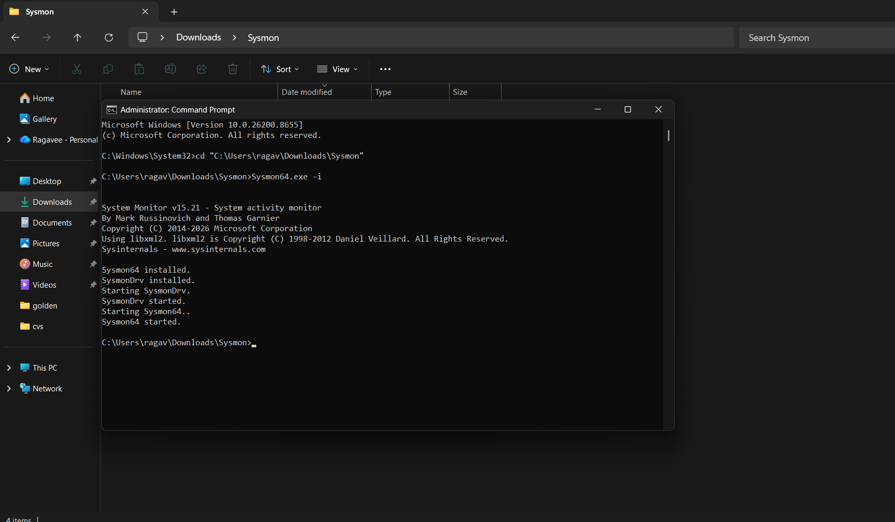
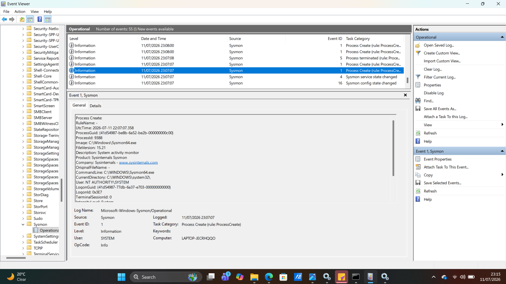

# Project 03 – Sysmon Process Creation Investigation

## Objective

The objective of this project was to install Microsoft Sysmon, verify that it was successfully collecting endpoint telemetry, and investigate Process Creation (Event ID 1) using Windows Event Viewer.

---

## Tools Used

- Microsoft Sysmon v15.21
- Windows Event Viewer
- Windows 11

---

## Skills Demonstrated

- Sysmon installation
- Windows endpoint monitoring
- Event log analysis
- Process creation investigation
- Windows DFIR
- Security event analysis

---

## Investigation Steps

1. Downloaded Sysmon from Microsoft Sysinternals.
2. Installed Sysmon using an elevated Command Prompt.
3. Verified that Sysmon installed successfully.
4. Opened Windows Event Viewer.
5. Navigated to:
**Applications and Services Logs → Microsoft → Windows → Sysmon → Operational**
6. Reviewed Process Create (Event ID 1) events.
7. Documented observations and findings.

---

# Evidence Collected

## Figure 1 – Sysmon Installation

The screenshot below shows the successful installation of Microsoft Sysmon.

---

## Figure 2 – Sysmon Process Create Event (Event ID 1)

The screenshot below shows a Process Create (Event ID 1) recorded in the Sysmon Operational log.

The investigation identified the following observations:

- Sysmon was successfully installed and running.
- Event ID 1 recorded a new process creation.
- The event included process details such as Process ID, Image, Command Line, User, and Timestamp.
- Endpoint telemetry was successfully captured for forensic analysis.
- Sysmon Operational logging was functioning correctly.

---

## Findings

- Microsoft Sysmon was installed successfully.
- Windows Event Viewer displayed Sysmon Operational logs.
- Process Create (Event ID 1) events were generated correctly.
- Detailed process execution information was available for investigation.
- Sysmon enhanced Windows logging with valuable endpoint telemetry.

---

## Conclusion

This investigation confirmed that Microsoft Sysmon was successfully deployed and configured to monitor process creation events. Sysmon Event ID 1 provides detailed process execution information that is valuable for incident response, threat hunting, malware analysis, and digital forensics.

---

## Skills Demonstrated

- Windows Endpoint Monitoring
- Sysmon Deployment
- Windows Event Viewer
- Process Creation Analysis
- Windows DFIR
- Security Event Analysis
