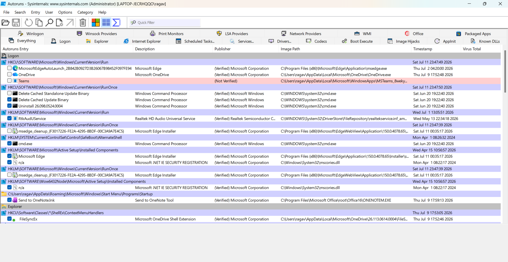
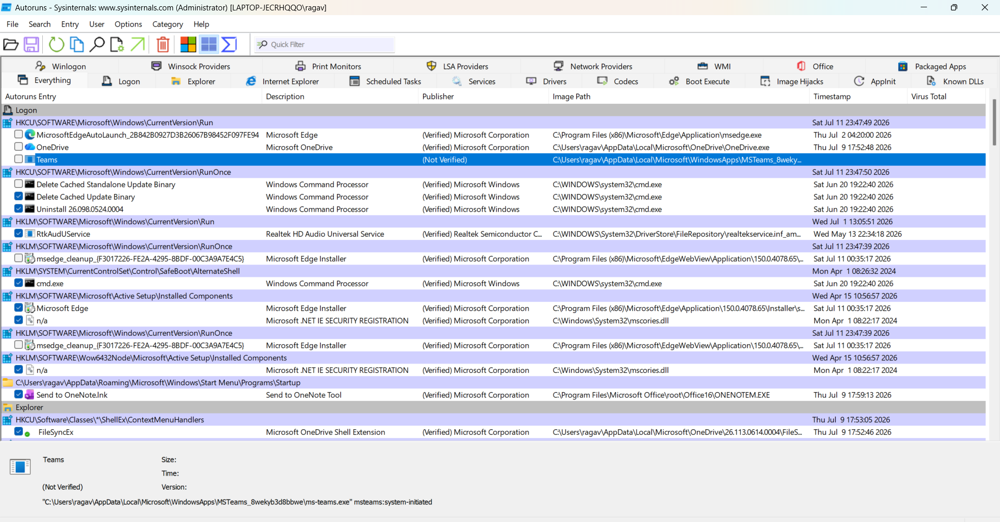
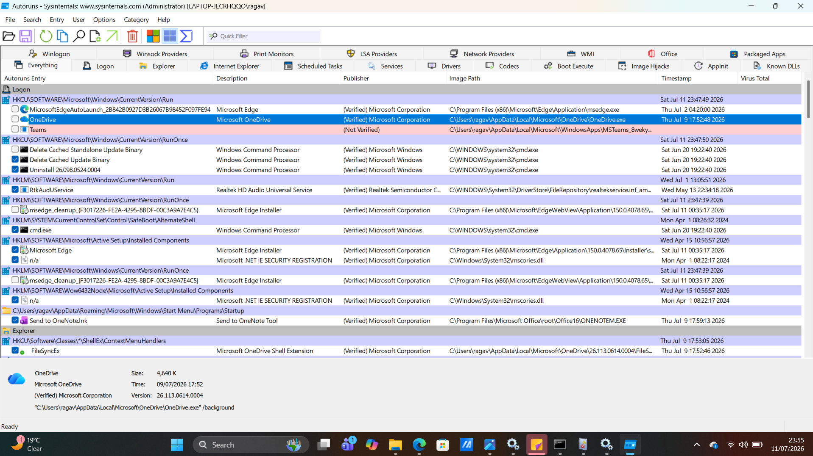

# Project 04 – Windows Autoruns Startup Investigation

## Objective

The objective of this project was to use Microsoft Sysinternals Autoruns to identify and analyze applications configured to start automatically during Windows startup. This exercise demonstrates how security analysts investigate persistence mechanisms commonly used by legitimate software and malware.

---

## Tools Used

- Microsoft Sysinternals Autoruns
- Windows 11
- File Explorer

---

## Skills Demonstrated

- Identifying Windows startup entries
- Investigating persistence mechanisms
- Examining executable file paths
- Verifying software publishers
- Distinguishing legitimate startup programs from potentially suspicious entries

---

## Investigation Steps

1. Downloaded Autoruns from Microsoft Sysinternals.
2. Extracted the Autoruns package.
3. Launched Autoruns with Administrator privileges.
4. Allowed Autoruns to scan startup locations.
5. Reviewed startup entries under the Logon tab.
6. Examined Microsoft Teams and Microsoft OneDrive startup entries.
7. Verified executable locations and digital publishers.
8. Documented findings.

---

## Evidence Collected

### Figure 1 – Autoruns Logon Overview

The screenshot below shows Autoruns displaying Windows startup entries configured to execute during user logon.

---

### Figure 2 – Microsoft Teams Startup Entry

The screenshot below shows the Microsoft Teams startup entry, including its registry location, executable path, and publisher information.

---

### Figure 3 – Microsoft OneDrive Startup Entry

The screenshot below shows the Microsoft OneDrive startup entry with a verified Microsoft digital signature and a legitimate executable path.

---

## Findings

- Microsoft Teams was configured to launch automatically at user logon.
- Microsoft OneDrive was configured as a legitimate startup application.
- Both applications were digitally signed by Microsoft.
- Executable paths matched expected Microsoft installation directories.
- No suspicious startup entries were identified during this investigation.

---

## Key Learning Outcomes

Through this project I learned how Windows applications establish persistence using startup locations and how Microsoft Sysinternals Autoruns helps security analysts identify programs that automatically execute during system startup. I also learned that startup entries should be evaluated based on publisher verification, executable location, and expected behavior rather than location alone.
