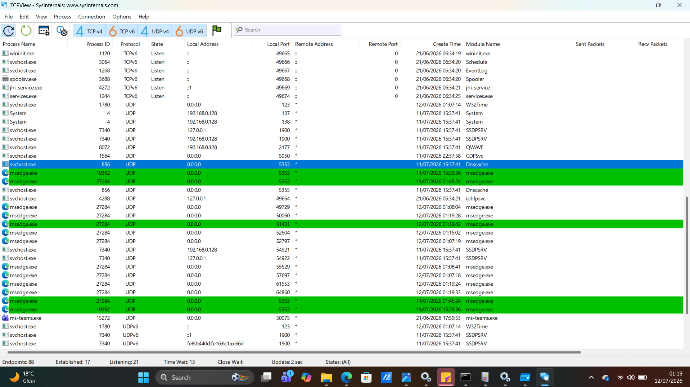
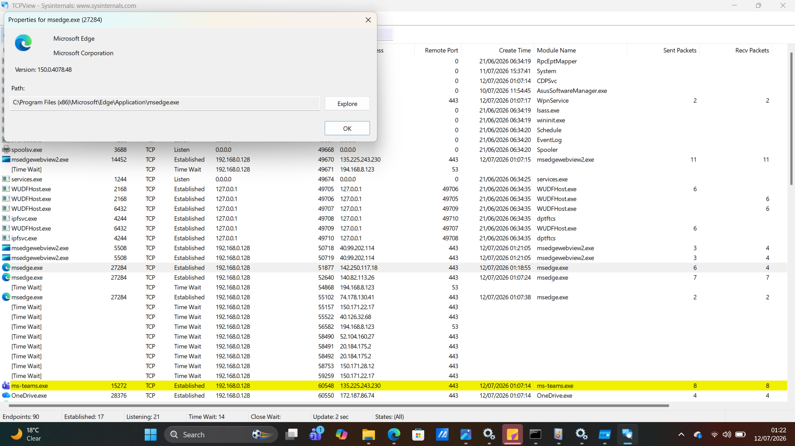

# Project 05 - TCPView Network Connection Investigation

## Objective

The objective of this project was to use Microsoft's TCPView utility to monitor active network connections, identify running processes communicating over the network, and verify whether the observed connections appeared legitimate.

---

## Tools Used

- TCPView (Sysinternals Suite)
- Microsoft Windows 11

---

## Skills Demonstrated

- Network connection monitoring
- Process identification
- Active connection analysis
- Process path verification
- Basic threat hunting
- Network investigation fundamentals

---

## Investigation Steps

1. Downloaded and launched TCPView as Administrator.
2. Observed active TCP and UDP connections.
3. Identified running processes with network activity.
4. Selected Microsoft Edge (msedge.exe) for investigation.
5. Opened Process Properties.
6. Verified executable location.
7. Confirmed the process was running from the legitimate Microsoft Edge installation directory.
8. Documented observations.

---

## Evidence Collected

### Figure 1 – TCPView Active Connections

The screenshot below shows TCPView displaying active TCP and UDP network connections for running processes.

---

### Figure 2 – Microsoft Edge Process Properties

The screenshot below shows the properties of the Microsoft Edge process, including the executable path and publisher information.

---

## Investigation Findings

The investigation identified the following observations:

- Microsoft Edge (msedge.exe) maintained multiple active network connections.
- Several HTTPS (TCP Port 443) connections were established.
- The executable path pointed to the legitimate Microsoft Edge installation directory.
- The process publisher was Microsoft Corporation.
- No suspicious executable paths or unknown publishers were identified during this investigation.
- The observed network activity appeared consistent with normal browser behavior.

---

## Key Learning

This project demonstrated how TCPView can be used to investigate active network connections and validate whether network communication originates from legitimate applications. It also reinforced the importance of verifying process names, executable paths, publishers, and active network sessions during security investigations.

---

## Conclusion

TCPView provides valuable visibility into live network activity and enables security analysts to quickly identify which processes are communicating over the network. This tool is useful for detecting suspicious outbound connections, verifying legitimate applications, and supporting incident response investigations.
