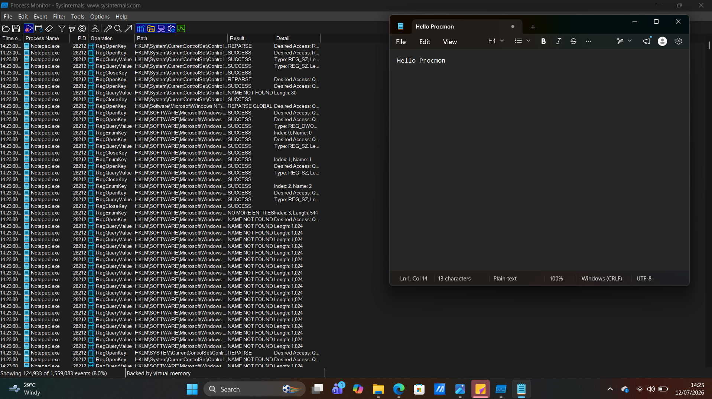
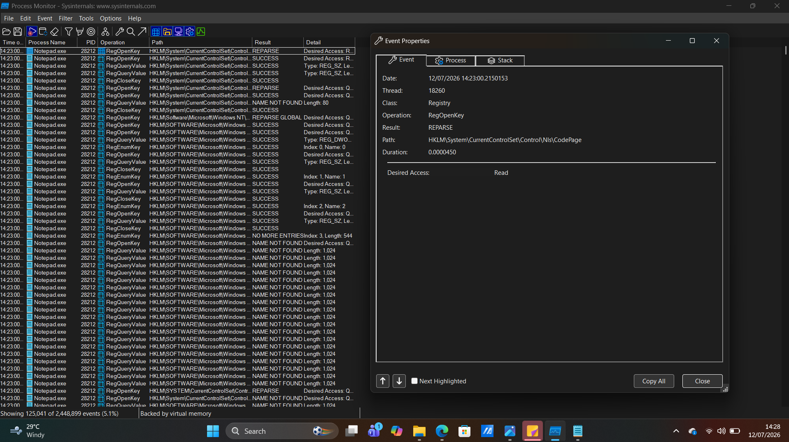

# Project 06 - Process Monitor (Procmon) Investigation

## Objective

The objective of this project was to use Microsoft Process Monitor (Procmon) to observe real-time system activity generated by a Windows application. The investigation focused on monitoring Notepad startup events, analyzing registry operations, and understanding how applications interact with the Windows operating system.

---

## Tools Used

- Microsoft Process Monitor (Procmon)
- Sysinternals Suite
- Windows 11
- Notepad

---

## Skills Demonstrated

- Real-time process monitoring
- Windows Registry analysis
- File system monitoring
- Process filtering
- Event analysis
- Windows internals investigation
- Digital forensics fundamentals

---

## Investigation Steps

1. Downloaded and launched Process Monitor as Administrator.
2. Cleared existing captured events.
3. Applied a filter for `Process Name is notepad.exe`.
4. Started a new capture.
5. Opened Notepad and generated activity.
6. Stopped the capture after several seconds.
7. Reviewed registry and file operations generated by Notepad.
8. Opened Event Properties to inspect an individual registry event.
9. Documented observations and findings.

---

## Evidence Collected

### Figure 1 – Procmon Filtered Events

The screenshot below shows Process Monitor capturing only events generated by **notepad.exe** after applying a process filter.

---

### Figure 2 – Registry Event Properties

The screenshot below shows the details of a **RegOpenKey** registry operation performed by Notepad during startup.

---

## Investigation Findings

The investigation identified the following observations:

- Process Monitor successfully captured real-time activity generated by Notepad.
- The application performed multiple registry read operations during startup.
- The selected event showed a **RegOpenKey** operation against a Windows registry key.
- The registry path belonged to the Windows National Language Support (NLS) configuration.
- The requested access was **Read**, indicating that Notepad was retrieving configuration information rather than modifying system settings.
- The **REPARSE** result reflected normal Windows registry redirection behavior and was not considered suspicious.
- No malicious process activity or unauthorized registry modifications were observed.

---

## Key Learning

This project demonstrated how Process Monitor provides deep visibility into process, file system, and registry activity. It reinforced the importance of analyzing registry operations within their proper context, as many events that appear unusual—such as **REPARSE**—are part of normal Windows behavior. The investigation also highlighted how filtering events helps analysts focus on a single process during forensic investigations.

---

## Conclusion

Process Monitor is an essential forensic and troubleshooting tool that enables security analysts to observe detailed system activity in real time. By examining process behavior, registry access, and file operations, analysts can identify suspicious activity, validate legitimate application behavior, and support incident response investigations.
