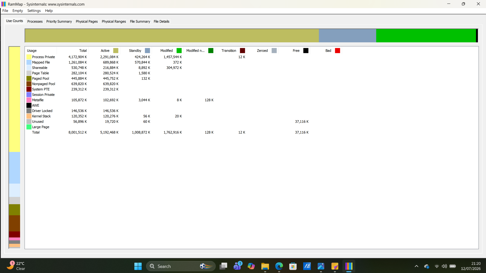
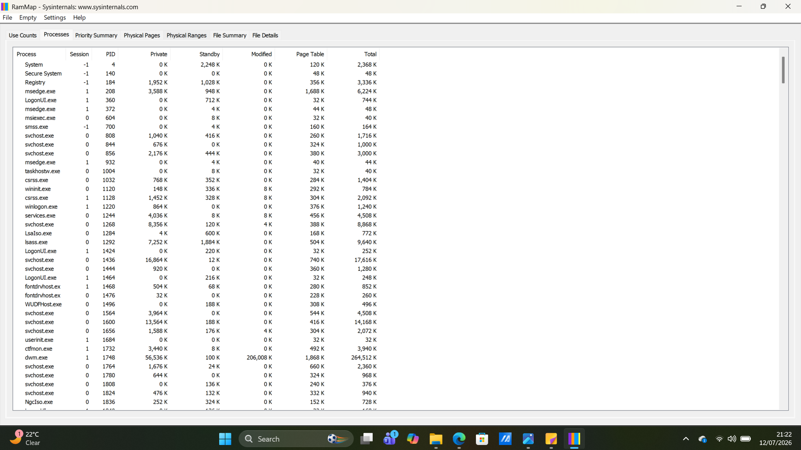
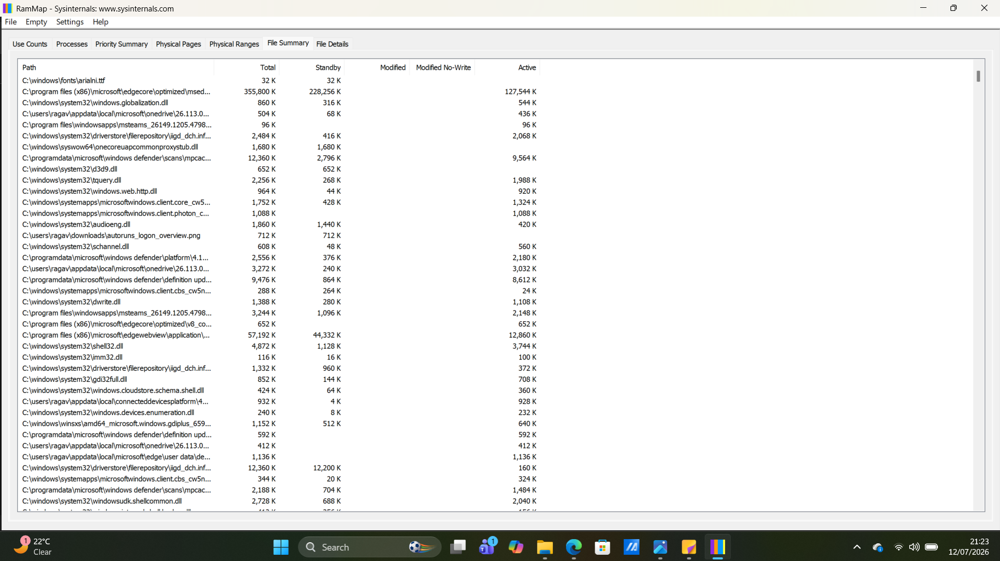

# Project 07 - RAMMap Memory Analysis

## Objective

The objective of this project was to use Microsoft Sysinternals RAMMap to analyze physical memory usage on a Windows system. The investigation focused on understanding how Windows allocates memory to running processes, system components, and cached files while identifying whether any abnormal memory usage was present.

---

## Tools Used

- Microsoft Sysinternals RAMMap
- Windows 11

---

## Skills Demonstrated

- Windows memory analysis
- Physical memory investigation
- Process memory analysis
- Memory allocation interpretation
- Windows internals investigation
- Basic DFIR memory analysis

---

## Investigation Steps

1. Downloaded and launched RAMMap as Administrator.
2. Allowed RAMMap to analyze the system's physical memory.
3. Examined the **Use Counts** tab to review overall memory allocation.
4. Reviewed the **Processes** tab to identify memory usage by running processes.
5. Examined the **File Summary** tab to understand Windows file caching.
6. Documented observations and findings.

---

## Evidence Collected

### Figure 1 – RAMMap Memory Overview

The screenshot below shows the **Use Counts** tab displaying the allocation of physical memory across different categories such as Process Private, Mapped File, Shareable, Paged Pool, Nonpaged Pool, and Free Memory.

---

### Figure 2 – Process Memory Usage

The screenshot below shows the **Processes** tab displaying the amount of physical memory consumed by individual Windows processes.

---

### Figure 3 – File Summary

The screenshot below shows the **File Summary** tab displaying files cached in physical memory to improve Windows performance.

---

## Investigation Findings

The investigation identified the following observations:

- Windows efficiently allocated physical memory across running applications and system processes.
- The largest memory allocation was associated with **Process Private** memory, representing memory used by active applications.
- Core Windows processes such as **System**, **svchost.exe**, **lsass.exe**, and **dwm.exe** showed expected memory usage.
- Windows used **Standby (cached) memory** to improve application performance.
- No abnormal or suspicious memory consumption was identified during the investigation.

---

## Key Learning

This project demonstrated how Microsoft Sysinternals RAMMap provides visibility into Windows memory usage. The investigation improved my understanding of physical memory allocation, process memory consumption, cached memory, and Windows memory management. It also reinforced the importance of establishing a baseline of normal memory usage before investigating potential memory-based threats or abnormal resource consumption.

---

## Conclusion

RAMMap is a valuable Windows memory analysis tool that enables security analysts to understand how physical memory is being utilized across the operating system. By examining memory allocation and process consumption, analysts can identify abnormal memory usage, support performance troubleshooting, and assist digital forensic investigations.

