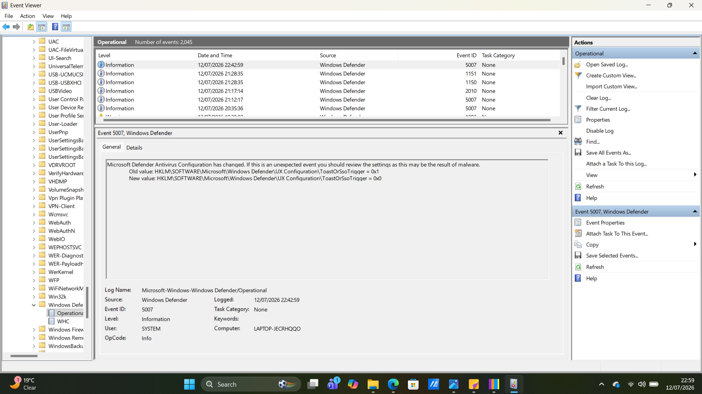
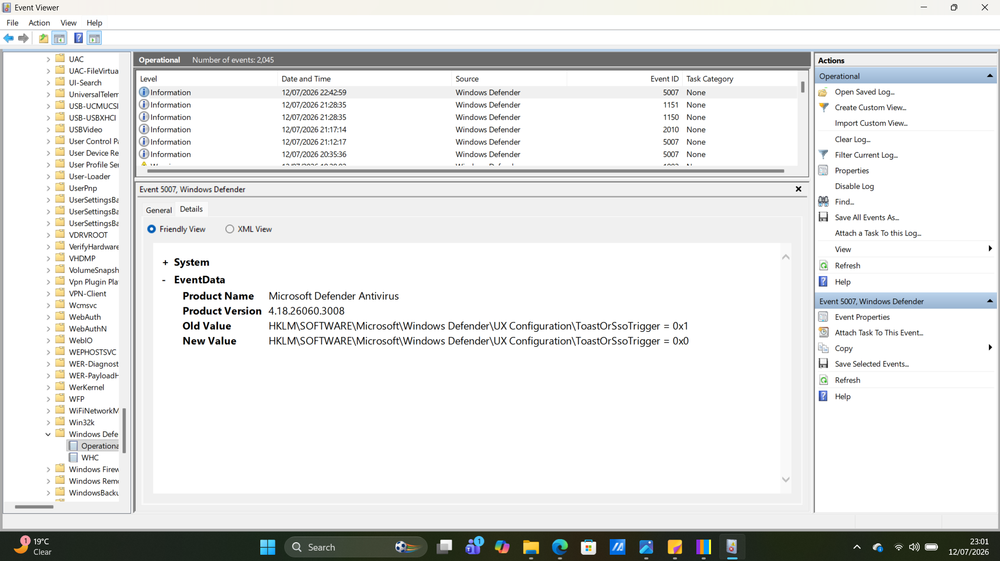
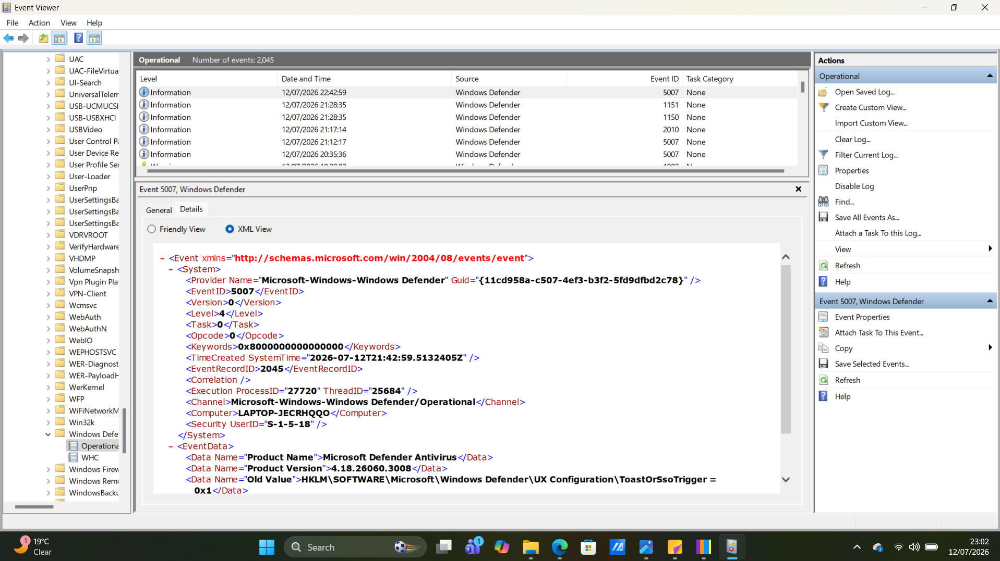

# Project 08 - Windows Defender Event Log Analysis

## Objective

The objective of this project was to explore Microsoft Defender Operational logs using Windows Event Viewer. The investigation focused on reviewing Defender security events, understanding Event IDs, and analyzing configuration changes that may indicate legitimate administrative activity or potential malicious behavior.

---

## Tools Used

- Windows Event Viewer
- Microsoft Defender Antivirus
- Windows 11

---

## Skills Demonstrated

- Windows Event Log analysis
- Microsoft Defender monitoring
- Event ID investigation
- Registry configuration analysis
- Security event interpretation
- Windows security monitoring
- Incident investigation fundamentals

---

## Investigation Steps

1. Opened Event Viewer as Administrator.
2. Navigated to:
**Applications and Services Logs → Microsoft → Windows → Windows Defender → Operational**
3. Reviewed Microsoft Defender Operational events.
4. Selected Event ID **5007** for further investigation.
5. Examined the **General** tab to understand the event description.
6. Viewed the **Details** tab in Friendly View.
7. Examined the event in XML View.
8. Documented observations and findings.

---

## Evidence Collected

### Figure 1 – Windows Defender Operational Log

The screenshot below shows Microsoft Defender Operational events displayed within Windows Event Viewer.

---

### Figure 2 – Event ID 5007 (General View)

The screenshot below shows the General tab explaining that Microsoft Defender detected a configuration change and recommends reviewing unexpected changes.

---

### Figure 3 and 4 – Event ID 5007 Details

The screenshot below shows the Details tab in Friendly View and XML View, displaying the raw event information recorded by Windows.

Figure 3

---

## Investigation Findings

The investigation identified the following observations:

- Event ID **5007** records Microsoft Defender configuration changes.
- The General tab warned that unexpected configuration changes should be reviewed because they may indicate malicious activity.
- Friendly View displayed the configuration values before and after the change.
- XML View contained the complete event record, including Provider Name, Event ID, Process ID, Timestamp, Computer Name, and Event Data.
- The observed configuration change appeared to be a legitimate Windows Defender setting modification.
- No evidence of malware or unauthorized Defender tampering was identified during this investigation.

---

## Personal Observations

During this investigation, I noticed that Windows Defender does not immediately classify configuration changes as malicious. Instead, it encourages analysts to investigate unexpected changes before making conclusions. I found this particularly useful because it reinforces the importance of verifying security events with context rather than assuming every alert is an attack.

I also learned that the Friendly View simplifies event interpretation for analysts, while the XML View exposes the complete raw event data used by SIEM platforms and forensic tools. Understanding both views helps security analysts validate events more effectively during incident investigations.

---

## Key Learning

This project demonstrated how Windows Defender logs provide valuable visibility into security-related configuration changes. It reinforced the importance of understanding Event IDs, reviewing event details, and validating changes before determining whether an event represents normal administrative activity or potential malicious behavior.

---

## Conclusion

Windows Defender Operational logs are an important source of security telemetry for SOC analysts. By reviewing Event IDs, configuration changes, and detailed event information, analysts can detect suspicious activity, verify legitimate system behavior, and support incident response investigations using native Windows logging capabilities.
