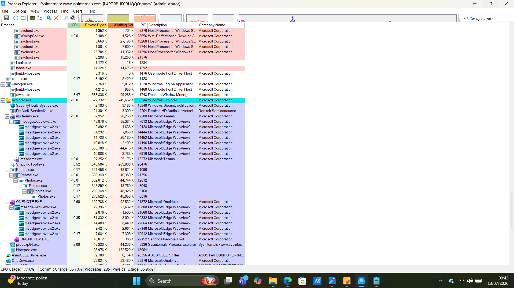
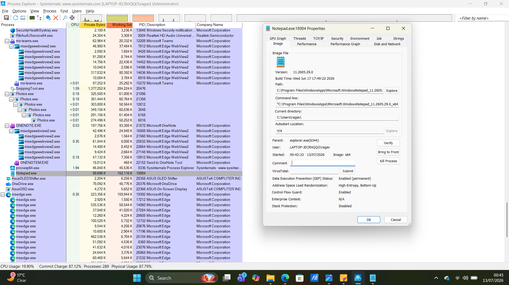
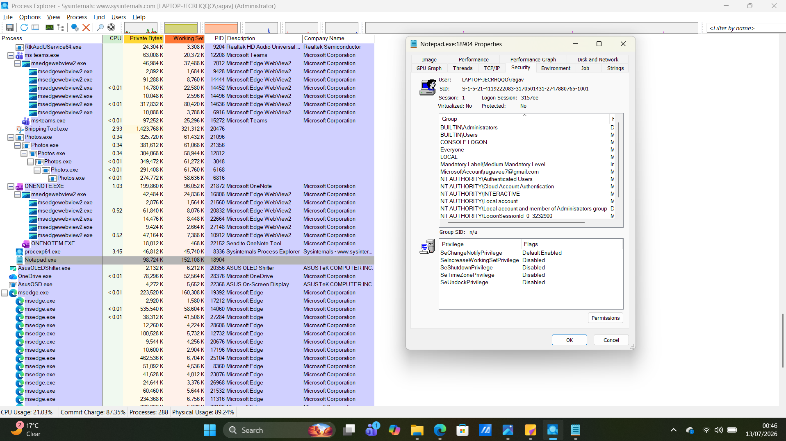

# Project 09 - Process Explorer Investigation

## Objective

The objective of this project was to use Microsoft Process Explorer to inspect running Windows processes, analyze parent-child process relationships, and examine detailed process properties. The investigation focused on understanding process memory usage, executable paths, security information, and identifying characteristics of legitimate Windows processes.

---

## Tools Used

- Microsoft Process Explorer (Sysinternals)
- Windows 11
- Notepad

---

## Skills Demonstrated

- Process tree analysis
- Parent-child process investigation
- Process property inspection
- Memory usage analysis
- Security context analysis
- Windows process identification
- Digital forensics fundamentals

---

## Investigation Steps

1. Downloaded and launched Process Explorer as Administrator.
2. Observed the Windows process tree.
3. Located and selected the **Notepad.exe** process.
4. Examined CPU usage, Private Bytes, Working Set, and Process ID (PID).
5. Opened the Notepad process properties.
6. Reviewed the Image and Security tabs.
7. Documented observations and findings.

---

## Evidence Collected

### Figure 1 – Process Explorer Overview

The screenshot below shows Process Explorer displaying the active Windows process tree with **Notepad.exe** selected.

---

### Figure 2 – Notepad Process Properties

The screenshot below shows the Image properties for **Notepad.exe**, including the executable path, parent process, command line, and security mitigation information.

---

### Figure 3 – Notepad Security Properties

The screenshot below shows the Security properties for **Notepad.exe**, displaying the user account, security identifiers (SIDs), group memberships, and assigned privileges.

---

## Investigation Findings

The investigation identified the following observations:

- Process Explorer displayed all active Windows processes in a parent-child hierarchy.
- The **Notepad.exe** process was launched by **explorer.exe**, indicating normal user activity.
- The executable path pointed to the legitimate Windows Notepad application.
- Private Bytes and Working Set provided insight into the application's memory usage.
- The Security tab displayed the process owner, group memberships, and security privileges.
- No suspicious parent-child relationships or abnormal process behavior were observed.

---

## Observations

During this investigation, I learned that Process Explorer provides much more information than Windows Task Manager. I was able to examine process memory usage, verify the executable location, inspect the parent process, and review the security context of a running application. Understanding these details helps distinguish legitimate processes from potentially malicious ones during incident response and malware investigations.

---

## Key Learning

This project demonstrated how Process Explorer enables security analysts to investigate Windows processes in greater detail. By examining process properties, memory usage, executable paths, and security information, analysts can identify abnormal behavior, validate legitimate processes, and support forensic investigations.

---

## Conclusion

Process Explorer is a powerful Windows forensic and troubleshooting tool that provides deep visibility into running processes. It enables analysts to investigate process relationships, inspect executable properties, analyze memory usage, and identify suspicious activity during security investigations.
