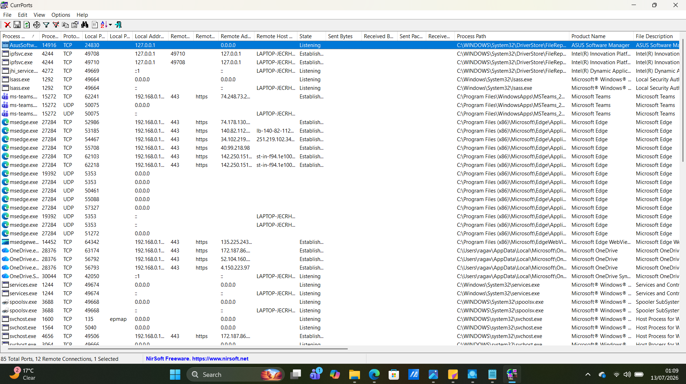
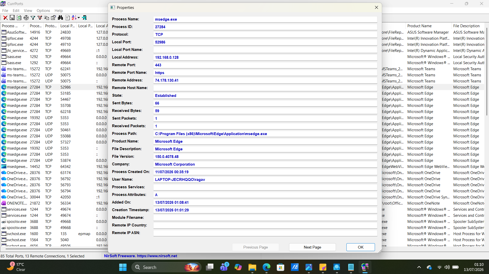
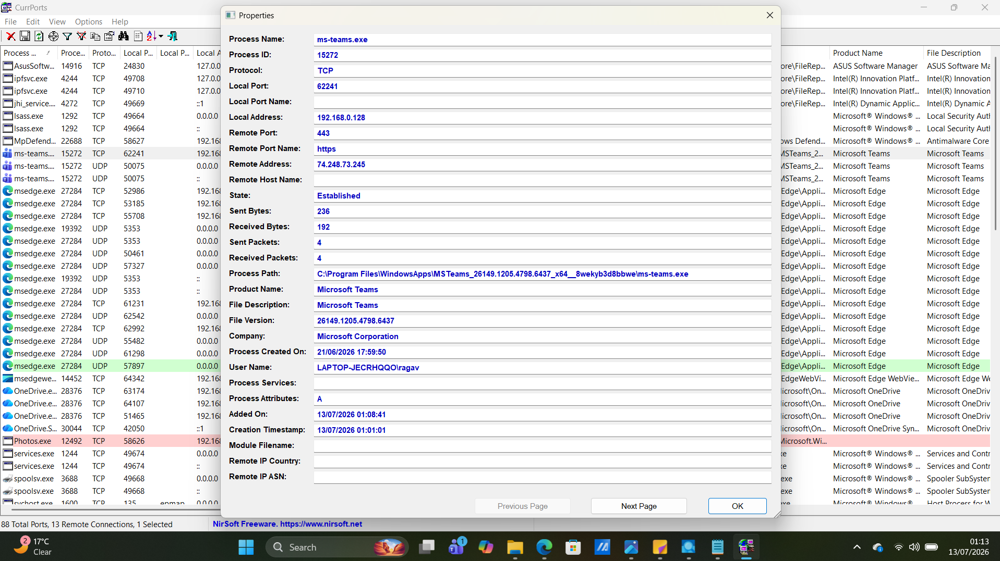

# Project 10 - CurrPorts Network Connection Investigation

## Objective

The objective of this project was to use NirSoft CurrPorts to examine active network connections on a Windows system. The investigation focused on identifying running processes, reviewing active TCP connections, analyzing local and remote IP addresses, and understanding how legitimate applications communicate across the network.

---

## Tools Used

- NirSoft CurrPorts
- Windows 11
- Microsoft Edge
- Microsoft Teams

---

## Skills Demonstrated

- Network connection analysis
- TCP/IP fundamentals
- Process-to-network correlation
- Active connection investigation
- Process property inspection
- Digital forensics fundamentals
- SOC investigation techniques

---

## Investigation Steps

1. Downloaded and launched CurrPorts as Administrator.
2. Observed all active TCP and UDP network connections.
3. Identified legitimate processes with active network activity.
4. Selected Microsoft Edge and Microsoft Teams for further investigation.
5. Reviewed connection properties, including local and remote IP addresses, ports, protocol, and connection state.
6. Examined executable paths and process information.
7. Documented observations and findings.

---

## Evidence Collected

### Figure 1 – CurrPorts Overview

The screenshot below shows CurrPorts displaying all active network connections, including process names, local and remote addresses, ports, protocols, and connection states.

---

### Figure 2 – Microsoft Edge Connection Properties

The screenshot below shows the connection properties for Microsoft Edge, including protocol, local and remote addresses, ports, process path, and connection state.

---

### Figure 3 – Microsoft Teams Connection Properties

The screenshot below shows an established network connection for Microsoft Teams communicating over HTTPS (TCP port 443).

---

## Investigation Findings

The investigation identified the following observations:

- CurrPorts successfully displayed all active TCP and UDP connections.
- Microsoft Edge and Microsoft Teams maintained active outbound HTTPS connections using TCP port 443.
- The executable paths pointed to legitimate Microsoft application directories.
- The connection state was **Established**, indicating active communication with remote servers.
- The local IP address belonged to the private network, while remote IP addresses represented external Microsoft services.
- No suspicious processes, unusual network ports, or unexpected executable locations were observed during the investigation.

---

## Observations

During this investigation, I learned how to correlate running processes with their active network connections. Reviewing process properties helped verify that Microsoft Edge and Microsoft Teams were communicating over encrypted HTTPS connections using legitimate executable paths. I also learned how connection states such as **Established** indicate active communication, while trusted process names, publishers, and executable locations help distinguish legitimate applications from potentially malicious ones.

---

## Key Learning

This project demonstrated how CurrPorts provides visibility into Windows network activity by linking processes to their network connections. Understanding process names, executable paths, connection states, and network ports enables security analysts to detect abnormal communication, identify suspicious applications, and support incident response investigations.

---

## Conclusion

CurrPorts is a valuable network investigation tool that allows analysts to monitor active connections, verify legitimate application behavior, and identify suspicious network activity. By correlating processes with network communications, analysts can better understand system behavior and quickly investigate potential security incidents.
